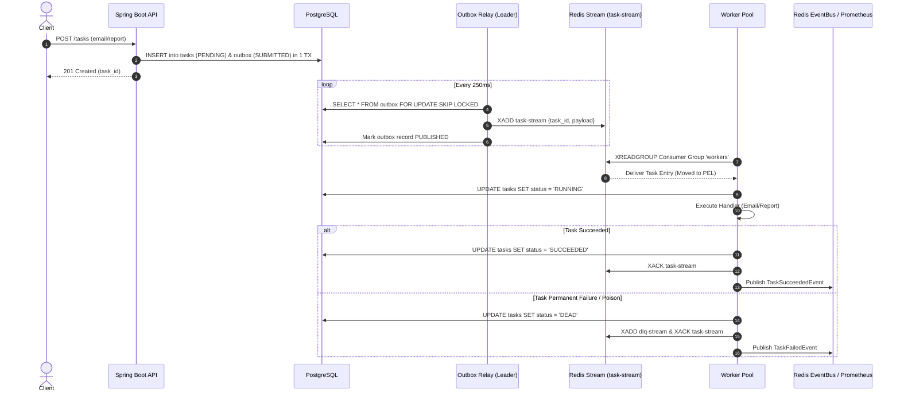

# Distributed Task Queue & Event Handling System

> A production-grade, highly-available, distributed event-driven task queue evolving from a single-node in-memory engine to a multi-replica, fault-tolerant cluster backed by **Spring Boot 3**, **PostgreSQL 16**, **Redis 7.2 Streams**, **Prometheus**, and **Grafana**.

---

## 📌 Background & Motivation

In modern microservice architectures, asynchronous background task execution and event handling are essential for offloading long-running operations (such as email processing, report generation, and data synchronization) from the synchronous HTTP request path.

Building a reliable task queue requires solving critical distributed systems challenges:
* **Durability & Zero Message Loss**: Guaranteeing tasks are never lost even if nodes crash or restart mid-execution.
* **Dual-Write Problem**: Ensuring data mutations and task enqueues happen atomically without partial failures.
* **At-Least-Once Delivery & Idempotency**: Safely processing retried messages without duplicate execution side-effects.
* **Horizontal Scalability**: Allowing task workers to scale dynamically across multiple replicas with proper load distribution and concurrency controls.
* **Observability**: Exposing real-time queue depth, latency histograms, throughput, and error rates via standardized metrics.

This project was built iteratively across **4 phases** to demonstrate the step-by-step architectural evolution from basic concurrency primitives to enterprise-grade distributed systems patterns.

---

## 🚀 Architectural Evolution (Phases 1 – 4)

| Phase | Architecture | Core Components | Key Capability |
|---|---|---|---|
| **Phase 1** | Pure Java Engine | `LinkedBlockingQueue`, `ExecutorService`, Atomic Counters | In-memory asynchronous execution with basic worker pool. |
| **Phase 2** | Durable Storage & HTTP API | Spring Boot 3, PostgreSQL 16, Flyway, HikariCP, REST API | Persistence across restarts, schema migrations, and REST submission. |
| **Phase 3** | Resilience & Observability | Resilience4j, Micrometer, Prometheus, Rate Limiter, DLQ | Circuit breakers, retry backoffs, dead-letter queues, and metric exporters. |
| **Phase 4** | Distributed & Event-Driven | Redis Streams (`XADD`/`XREADGROUP`), Outbox Pattern, Leader Election, Grafana | Horizontal worker scaling, multi-node leader election, transactional outbox, and live visual dashboards. |

---

## 🏗️ System Architecture

```
┌──────────────────────────────────────────────────────────────────────────────────┐
│                         Phase 4 Distributed Architecture                          │
│                                                                                  │
│  REST API Layer            Broker Layer              Worker Pool (Replicas)      │
│  ┌──────────────┐          ┌─────────────────┐       ┌────────────────────────┐ │
│  │ POST /tasks  │─Outbox──▶│  Redis Streams  │◀──────│ Worker 1 (Virtual Thr) │ │
│  │ RateLimiter  │          │   task-stream   │       │ AckableTaskQueue       │ │
│  └──────────────┘          └─────────────────┘       │ IdempotentHandler      │ │
│                                                      └────────────────────────┘ │
│  Persistence Layer         ┌─────────────────┐       ┌────────────────────────┐ │
│  ┌──────────────┐          │   dlq-stream    │       │ Worker 2 (Virtual Thr) │ │
│  │ PostgreSQL 16│          └─────────────────┘       │ AckableTaskQueue       │ │
│  │  • tasks     │                                    │ IdempotentHandler      │ │
│  │  • outbox    │          Event Bus Layer           └────────────────────────┘ │
│  │  • dead_ltr  │          ┌─────────────────┐                                  │
│  │  • audit_log │          │  Redis Pub/Sub  │       Monitoring & Metrics       │
│  └──────────────┘          │   task-events   │       ┌────────────────────────┐ │
│                            └─────────────────┘─────▶ │ Prometheus (Port 9090) │ │
│  Outbox Relay                      │                 │ Grafana (Port 3000)    │ │
│  ┌──────────────┐          Leader Election           └────────────────────────┘ │
│  │ OutboxRelay  │          ┌─────────────────┐                                  │
│  │ (Leader Node)│          │  Redis Keys     │                                  │
│  └──────────────┘          │  leader:*       │                                  │
│                            └─────────────────┘                                  │
└──────────────────────────────────────────────────────────────────────────────────┘
```

---

## ⚡ Data & Processing Lifecycle



---

## 🛠️ Technology Stack & Design Patterns

### Core Technologies
* **Java 21**: Modern Java features, Records, and Virtual Thread execution.
* **Spring Boot 3.3.5**: Web, Data JDBC, Data Redis, Actuator, and Scheduling modules.
* **PostgreSQL 16**: Primary relational store for durable task state and transactional outbox.
* **Redis 7.2**: In-memory broker backing **Redis Streams** (`task-stream`), **Distributed Locks** (Lua CAS), and **Pub/Sub Event Bus**.
* **Flyway**: Database schema migration and versioning control.
* **Prometheus (v2.53.0)**: Time-series metrics collector scraping `/actuator/prometheus`.
* **Grafana (v10.4.0)**: Visual dashboarding for real-time throughput, latency, queue depth, and task status metrics.
* **Docker & Docker Compose**: Multi-container containerization and cluster orchestration.

### Software Architecture & Design Patterns
* **Transactional Outbox Pattern**: Eliminates dual-write inconsistencies between database mutations and message queue publishes.
* **Leader Election (Lua CAS)**: Guarantees single-active execution for background outbox relays using Redis TTL locks.
* **Finite State Machine (FSM)**: Strict legal state transitions (`PENDING` $\rightarrow$ `RUNNING` $\rightarrow$ `SUCCEEDED` / `DEAD` / `RETRYING`).
* **Ports & Adapters (Hexagonal Architecture)**: Core task processing decoupled from specific queue implementations (easily swap between Redis Streams, Kafka, and In-Memory).
* **Observer Pattern**: Decoupled `@EventListener` architecture for publishing domain events and recording Micrometer metrics without polluting transactional business services.

---

## 📋 Prerequisites & Quick Start

### Prerequisites
* **Docker Desktop** (with Docker Compose)
* **PowerShell 7+** (Windows) or **Bash** (Linux/macOS)
* **Java 21 SDK** & **Maven 3.9+** (for local development outside Docker)

---

## 🏃 Running the Application

### 1. Run via Automated Script (Recommended)

The repository includes complete end-to-end automation scripts that prune caches, build containers, run database migrations, launch the cluster, submit 50 diverse workload tasks, and report verification status:

**Windows (PowerShell)**:
```powershell
.\run_end_to_end_test.ps1
```

**Linux / macOS (Bash)**:
```bash
chmod +x run_end_to_end_test.sh
./run_end_to_end_test.sh
```

---

### 2. Manual Docker Setup

**Step 1: Start Container Stack (API + 2 Workers + Postgres + Redis + Prometheus + Grafana)**:
```bash
docker-compose up -d --scale worker=2
```

**Step 2: Check Container Status**:
```bash
docker-compose ps
```

**Step 3: Stop Stack and Clean Volumes**:
```bash
docker-compose down -v --rmi all
```

---

## 🌐 Access Points & Dashboards

| Component | URL / Endpoint | Credentials | Purpose |
|---|---|---|---|
| **API Base URL** | `http://localhost:8080` | None | REST Task Submission & Querying |
| **Grafana Dashboard** | `http://localhost:3000/d/taskqueue-phase4/distributed-task-queue` | `admin` / `admin` | Real-Time Metrics & Charts |
| **Prometheus UI** | `http://localhost:9090` | None | Raw PromQL Metric Queries & Scrape Targets |
| **Actuator Metrics** | `http://localhost:8080/actuator/prometheus` | None | Raw Prometheus Metrics Export |
| **PostgreSQL Database** | `localhost:5433` | `taskqueue` / `taskqueue` | Database: `taskqueue` |
| **Redis Server** | `localhost:6379` | None | Streams & Lock Key Store |

---

## 🔌 REST API Endpoint Reference

### 1. Submit a Task
`POST /tasks`

**Request Body (Immediate Task)**:
```json
{
  "type": "email",
  "payload": {
    "to": "user@example.com",
    "subject": "Welcome to Distributed Task Queue"
  },
  "maxAttempts": 3
}
```

**Request Body (Scheduled / Delayed Task)**:
```json
{
  "type": "report",
  "payload": {
    "reportId": "RPT-1002"
  },
  "scheduledAt": "2026-07-28T22:30:00.000Z",
  "maxAttempts": 3
}
```

**Request Body (High Priority Task)**:
```json
{
  "type": "email",
  "payload": {
    "to": "vip@example.com"
  },
  "priority": 100
}
```

**Response (`201 Created`)**:
```json
{
  "id": "dc12d9b8-f1b1-4154-842b-41adecb85c2d",
  "status": "PENDING"
}
```

---

### 2. Query Task Status by ID
`GET /tasks/{id}`

**Response (`200 OK`)**:
```json
{
  "id": "dc12d9b8-f1b1-4154-842b-41adecb85c2d",
  "type": "email",
  "status": "SUCCEEDED",
  "attempts": 1,
  "maxAttempts": 3,
  "createdAt": "2026-07-28T17:30:40.002Z",
  "scheduledAt": "2026-07-28T17:30:40.002Z",
  "lastError": null
}
```

---

## 📊 Live Grafana Metrics & Monitoring

The Grafana dashboard (`Distributed Task Queue — Phase 4`) tracks key health indicators:

* **Total Tasks Submitted**: Cumulative count of tasks submitted to API (`taskqueue_tasks_submitted_total`).
* **Total Tasks Succeeded**: Tasks completed by workers (`taskqueue_tasks_succeeded_total`).
* **Total Tasks Dead (DLQ)**: Permanent failure tasks routed to DLQ (`taskqueue_tasks_dead_total`).
* **Current Queue Depth**: Point-in-time queue depth (`taskqueue_queue_depth`).
* **Task Throughput (tasks/s)**: Combined rate of Submitted, Succeeded, Failed, and Retried tasks per second.
* **Relay & Scheduler Executions**: Ticks per second for Outbox Relay and Leader Scheduler.

---

## 🧪 Testing & Verification Scripts

The `run_end_to_end_test.ps1` script executes a full 50-task workload test:

1. **25 Immediate Tasks** (`email` & `report`): Processed instantly by workers.
2. **10 Delayed Tasks** (scheduled 30s in future): Held in `SCHEDULED` state until maturity time, then processed.
3. **10 Poison / DLQ Tasks** (`unregistered_type`): Trapped safely and moved to Dead-Letter Queue.
4. **5 High-Priority Tasks** (`priority = 100`): Dispatched ahead of standard priority tasks.

### Empirical Database Verification Command:
```sql
SELECT status, COUNT(*) FROM tasks GROUP BY status ORDER BY status;
```

**Expected Baseline Output**:
```text
  status   | count 
-----------+-------
 DEAD      |    10
 SUCCEEDED |    40
```

---

## 📜 Repository Structure

```
distributed-event-handling/
├── Dockerfile                      # Multi-stage Docker build for API & Worker
├── docker-compose.yml              # Cluster topology (API, Workers, Postgres, Redis, Prom, Grafana)
├── pom.xml                         # Maven dependencies & build plugins
├── prometheus.yml                  # Prometheus scrape config for API & Worker targets
├── run_end_to_end_test.ps1         # Windows PowerShell test automation runner
├── run_end_to_end_test.sh          # Linux/macOS Shell test automation runner
├── docs/                           # Architecture specs, capacity plans, & runbooks
├── grafana/                        # Grafana provisioning configurations & dashboards
└── src/
    ├── main/
    │   ├── java/com/taskqueue/
    │   │   ├── broker/             # Redis Streams & Kafka Adapters
    │   │   ├── common/             # Result & utility types
    │   │   ├── config/             # Spring & Phase 4 Configuration Beans
    │   │   ├── dlq/                # Dead Letter Queue implementations
    │   │   ├── event/              # EventBus, Redis Pub/Sub & Listeners
    │   │   ├── handler/            # Task Handlers (Email, Report)
    │   │   ├── lock/               # Leader Elector & Lua CAS Distributed Lock
    │   │   ├── metrics/            # Micrometer TaskMetrics exporters
    │   │   ├── model/              # Domain Models (Task, TaskStatus FSM)
    │   │   ├── outbox/             # Outbox Relay & Record Management
    │   │   ├── queue/              # Task Queue Port & Ackable Interfaces
    │   │   ├── ratelimit/          # Redis Token Bucket Rate Limiter
    │   │   ├── repo/               # JDBC Repositories (SKIP LOCKED queries)
    │   │   ├── retry/              # Exponential Backoff & Retry Policies
    │   │   ├── scheduler/          # Leader-Elected Task Scheduler
    │   │   ├── service/            # Transactional Task Services
    │   │   └── worker/             # Virtual-thread Worker Pool & Loop
    │   └── resources/
    │       ├── application.yml     # Core Configuration Properties
    │       └── db/migration/       # Flyway SQL Migration Scripts (V1–V5)
    └── test/                       # Integration & Unit Test Suites
```

---

## 🛡️ License

Distributed under the MIT License. See `LICENSE` for more information.
